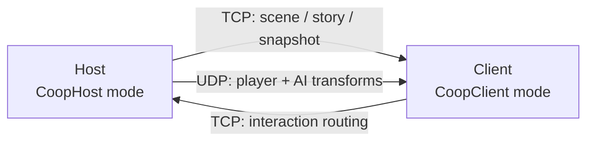

# Woodbury Co-op Sync

Minimal BepInEx 5 LAN co-op tooling for **Fears to Fathom: Woodbury Getaway**.

Host-authoritative, focused on keeping two LAN game instances aligned: scene loads, player transforms, doors, holdables, dialogue signals, story flags, and visible remote avatars.

> [!NOTE]
> Status: WIP. Cabin is the deepest tested flow; Pizzeria and RoadTrip have partial sync coverage. See [`README_STATUS.md`](README_STATUS.md) for the live punch list.

---

## At a Glance

| | |
|---|---|
| **Target game** | Fears to Fathom: Woodbury Getaway (Unity 2021.3) |
| **Runtime** | BepInEx 5 Mono, .NET Framework 4.7.2 |
| **Topology** | Host-authoritative LAN, single client |
| **Transports** | TCP (reliable state) + UDP (transforms) |
| **Output** | Single DLL, plugin id `com.woodbury.spectatorsync` |

## Architecture



Connection lifecycle: `Hello` → `HelloAck` → `SceneChange` → `SceneReady` → `SnapshotBegin` / `SnapshotEnd` → `SnapshotAck` → **`Live`**. Once live, host emits world and story deltas and the client applies them. UDP transform apply is gated until `Live`; protocol-version mismatches are rejected at handshake.

## What Works

- Co-op host/client over LAN or same PC
- Session lifecycle with explicit state machine and bracketed snapshot acknowledgement
- Door, holdable, dialogue, story flag, and basic AI transform sync
- Client interaction routing to the host
- Remote player proxy with AssetBundle, in-scene game-model fallback, or capsule
- In-game overlay with connection, scene, queue, story, and Mike sync diagnostics

## Known Gaps

- Story parity is still expanding scene by scene
- Dialogue UI mirroring is incomplete
- Item ownership, hand attachment, physics, and a true second-player gameplay controller are incomplete
- Quaternius AssetBundle avatars require a valid `AnimatorController`; otherwise the mod falls back to safe game-model avatars

---

## Quick Start

### 1. Prerequisites

- [.NET SDK](https://dotnet.microsoft.com/download)
- A local install of the game with **BepInEx 5 Mono** present
- Reference DLLs copied from the game install into `lib/`

```powershell
.\scripts\CopyLibs.ps1 -GameDir "<PATH_TO_GAME>"
```

> [!TIP]
> `<PATH_TO_GAME>` is the folder containing `Fears to Fathom - Woodbury Getaway.exe`. On Steam: <kbd>Right-click game</kbd> → **Manage** → **Browse local files**.

### 2. Build

```powershell
dotnet build .\src\WoodburySpectatorSync\WoodburySpectatorSync.csproj -c Release
```

Output:

```text
src\WoodburySpectatorSync\bin\Release\net472\WoodburySpectatorSync.dll
```

### 3. Install

Drop the DLL into your BepInEx plugins folder:

```text
<GameDir>\BepInEx\plugins\WoodburySpectatorSync.dll
```

Optional avatar bundles live alongside it:

```text
<GameDir>\BepInEx\plugins\WoodburySpectatorSync\avatars\
```

---

## Launching Two Paired Instances

The launcher writes separate host and client configs and starts two windowed instances on the same PC for testing:

```powershell
.\scripts\Launch-CoopPair.ps1 `
  -GameDir "<PATH_TO_GAME>" `
  -AutoStartHost `
  -AutoConnectClient `
  -ForceStopExisting
```

> [!WARNING]
> `-ForceStopExisting` terminates any running instance of the game. Omit it if you have an unsaved session running.

## Manual Co-op Flow

1. **Host** — set `Mode = CoopHost`, enter the target scene, press <kbd>F6</kbd> to start hosting.
2. **Client** — set `Mode = CoopClient` and `SpectatorHostIP` to the host IP. Stay at the menu and press <kbd>F7</kbd> to connect.

### Hotkeys

| Key | Action |
|:---:|---|
| <kbd>F6</kbd> | Toggle host on/off |
| <kbd>F7</kbd> | Connect client |
| <kbd>F8</kbd> | Toggle in-game overlay |
| <kbd>F9</kbd> | Progress / debug action |

---

## Configuration

Settings live in `<GameDir>\BepInEx\config\com.woodbury.spectatorsync.cfg` (or `.host.cfg` / `.client.cfg` when launched via the paired launcher).

| Key | Default | Notes |
|---|---|---|
| `Mode` | `CoopHost` | `CoopHost` / `CoopClient` / `Host` / `Spectator` |
| `HostPort` | `27055` | TCP listen port |
| `UdpEnabled` | `true` | Enables UDP transform channel |
| `UdpPort` | `27056` | UDP port (host listens, client sends) |
| `UseLocalPlayerController` | `true` | Client uses its own controller instead of freecam |
| `RouteInteractionsToHost` | `true` | Forward client interactions for host authority |
| `RemotePlayerAvatarSource` | `Auto` | `Auto` / `GameModel` / `AssetBundle` / `Capsule` |
| `RemotePlayerAvatarId` | `woodbury_scene_auto` | e.g. `quaternius_regular_male` |
| `RemotePlayerAvatarYOffset` | `0` | Vertical correction in meters |
| `ForceCabinStartSequence` | `true` | Skip Cabin intro on client |
| `CabinStartSequence` | `StartAfterShower` | Forced sequence name |

<details>
<summary><strong>Environment-variable overrides</strong> (for headless / launcher use)</summary>

| Variable | Effect |
|---|---|
| `WSS_CONFIG` | Explicit config file path |
| `WSS_MODE` | Mode override |
| `WSS_UDP` | `0` / `1` for UDP enabled |
| `WSS_HOST_IP` | Host IP for client |
| `WSS_HOST_PORT` | Host TCP port |
| `WSS_UDP_PORT` | UDP port |
| `WSS_SESSION_LOG` | Session log path |

</details>

---

## Avatars

The default `RemotePlayerAvatarSource=Auto` (`woodbury_scene_auto`) clones an in-scene game model with scripts, colliders, cameras, audio, rigidbodies, and agents stripped — visual-only.

AssetBundle path:

```text
<GameDir>\BepInEx\plugins\WoodburySpectatorSync\avatars\woodbury_avatars.bundle
```

The current Quaternius bundle requires a Unity 2021.3-built bundle with an `AnimatorController`. If the bundle is render-only, runtime logs reject it with `reason=no Animator`.

See [`tools/AvatarBundle/README.md`](tools/AvatarBundle/README.md) for building bundles.

---

## Diagnostics

### Logs

```text
<GameDir>\BepInEx\logs\
```

Useful greps when reading session logs:

| Pattern | Surfaces |
|---|---|
| `Co-op session host:` / `Co-op session client:` | Lifecycle state transitions |
| `Co-op scene ready` | Scene handshake completion |
| `Mike sync target` | Cabin Mike sync target selection |
| `Cabin client runtime state held local` | Client-side suppressed state |
| `Remote player avatar` | Avatar source / fallback diagnostics |

The in-game overlay (toggle <kbd>F8</kbd>) surfaces live `Session: <state> sid=<id> gen=<n>` plus snapshot ack and retry counts — read it first when triaging desync.

---

## Project Layout

```text
src/WoodburySpectatorSync/   plugin source
scripts/                     PowerShell build / launch utilities
lib/                         game + Unity reference DLLs (populated by CopyLibs.ps1)
decompiled/                  read-only reference C# from the game's assemblies
tools/AvatarBundle/          Unity 2021.3 project for avatar bundles
```

## Roadmap

- Finish Cabin story parity through board game, Ouija, eating, hiding, hiker, and endgame
- Improve dialogue and choice synchronization
- Expand validated coverage for RoadTrip and Pizzeria
- Replace fallback avatars with a reliable animated bundle
- Networked AI behavior state (not only transform)
- Item ownership, hand attachment, and throw events
- True second-player gameplay controller per scene

See [`CHANGELOG.md`](CHANGELOG.md) for history and [`README_STATUS.md`](README_STATUS.md) for current debugging notes.
